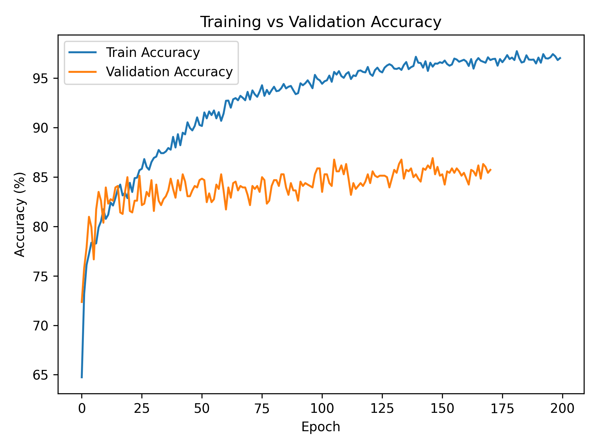

# Detect Pneumonia from Chest X-Rays

Chest X-ray image classification for pneumonia detection.

---

## TL;DR
- **Task:** Classify chest X-ray images (3-class: *Normal / Bacterial / Viral*).
- **Approach:** Transfer learning with modern CNN/ViT (ResNet101, DenseNet169, DeiT) + strong medical-image augmentations + class-aware sampling.
- **Key extras:** Custom loss functions, label smoothing, custom k-fold cross-validation.

---

## 1. Competition Overview
- **Name:** Detect Pneumonia (Spring 2024)
- **Host:** Kaggle (private classroom competition)
- **Goal:** Predict pneumonia subtype from chest X-rays (Normal, Bacterial, Viral)
- **Metric:** Accuracy
- **Submission format:** CSV schema (`image_id,class_id`)

---

## 2. Dataset

This dataset is based on the well‑known Chest X‑Ray (Pneumonia) dataset.

- Training set: **4,672** chest X-ray images  
    - Normal: **1,227**  
    - Bacterial Pneumonia: **2,238**  
    - Viral Pneumonia: **1,207**

- Test set: **1,168** images (unlabeled for leaderboard submission)

- Folder layout:

```
Detecting-Pneumonia-From-Chest-X-Rays/
  dataset/
    train_images/
      README.txt                
    test_images/
      README.txt
    labels_train.csv             # Total training images (NORMAL/BACTERIAL/VIRAL)
    train_labels.csv             # Train split labels
    val_labels.csv               # Val split labels
```

---

## 3. Method

### 3.1 Preprocessing & Data Augmentation

**Training transforms**:
- Convert image to PIL
- Resize to 256×256
- RandomResizedCrop to 224×224
- RandAugment + AugMix
- Convert to Tensor
- Normalize (ImageNet mean/std)

These augmentations significantly improve generalization by introducing variations in scale, color, contrast, and structure.

**Validation transforms**:
- Convert to PIL
- Resize to 256
- Center Crop to 224
- Convert to Tensor
- Normalize (ImageNet mean/std)

Validation is deterministic to allow fair comparison across epochs.

---

### 3.2 Architectures

The main model used in this project was **DeiT-Base (patch16, 224×224)**, a Vision Transformer pretrained on ImageNet.

- Frozen transformer backbone (stable + fast training)
- Fine-tuned MLP + classification head
- CrossEntropyLoss with label smoothing

**Baselines also evaluated**
- DenseNet-169
- EfficientNet-B4
- ResNet-101
- MobileNet-V3
- ShuffleNet-V2
- Ensemble model (averaged logits)

All models use a 3-class classifier (`num_classes = 3`) with softmax output.

---

### 3.3 Loss & Optimization
- **Loss:** CrossEntropy (optionally ReducedCrossEntropy)
- **Optimizer:** AdamW
- **Scheduler:** CosineAnnealingLR
- **Batch size:** 64
- **Epochs:** 200

---

### 3.4 Cross-Validation
- Stratified K-Fold CV on training set
- Used for more reliable generalization estimates

---

## 4. Results

Best performance achieved by **DeiT (Vision Transformer)**:

| Model | Accuracy |
|-------|----------|
| **DeiT-Base (Patch16/224)** | **87%** |
| DenseNet-169 | 84% |
| EfficientNet-B4 | 83% |
| ResNet-101 | 82% |
| MobileNet-V3 | 80% |
| ShuffleNet-V2 | 79% |
| Ensemble (averaged logits) | 85% |

**Training setup**
- Frozen backbone
- Fine-tuned head only
- AdamW + Cosine Scheduler
- Label Smoothing (0.1)




---

## 5. Project Structure

```
Detecting-Pneumonia-from-Chest-X-Rays/
│
├── configs/                     # YAML configuration files for training
│   └── PNEUMONIA.yaml
│
├── dataset/                     # Chest X-ray dataset (train/test)
│   ├── train_images/
        └── README.txt
│   ├── test_images/
        └── README.txt
│   ├── labels_train.csv
│   ├── train_labels.csv
│   ├── val_labels.csv
│
├── models/                      # Model architectures
│   ├── deit.py                  
│   ├── densenet.py
│   ├── efficientnet.py
│   ├── mobilenet.py
│   ├── resnet.py
│   ├── shufflenet.py
│   └── ensemble.py
│
├── scripts/                     # Utility scripts 
|   ├── datasets.py              # Dataset loader + transforms
│   ├── inference.py             # Run model on test set 
|   ├── losses.py                # Bregman-based loss functions
│   ├── train.py                 # Main training script
│   └── visualizations.py        # Accuracy/error plots from JSON logs
│
├── README.md
└── LICENSE
```

---

## 6. Experiments
- Image size: 224 vs 384 vs 512  
- Backbone comparison: EfficientNet-V2-S vs DeiT-B/16  
- Loss comparison: CE vs ReducedCrossEntropy

---

## 7. Troubleshooting
- **Overfitting early:** stronger augmentation, reduce LR, add weight decay, early stopping  
- **Unstable CV:** increase folds, fix seeds, check stratification  
- **Low recall on Normal:** class weights, investigate sampling, add stronger brightness/contrast aug

---

## 8. License & Acknowledgments
- **Code:** MIT License  
- **Data:** Provided through classroom competition; redistribution not allowed  
- **Thanks:** Kaggle & course instructors

---

## 9. Changelog
**v1.0.0** – Initial release
